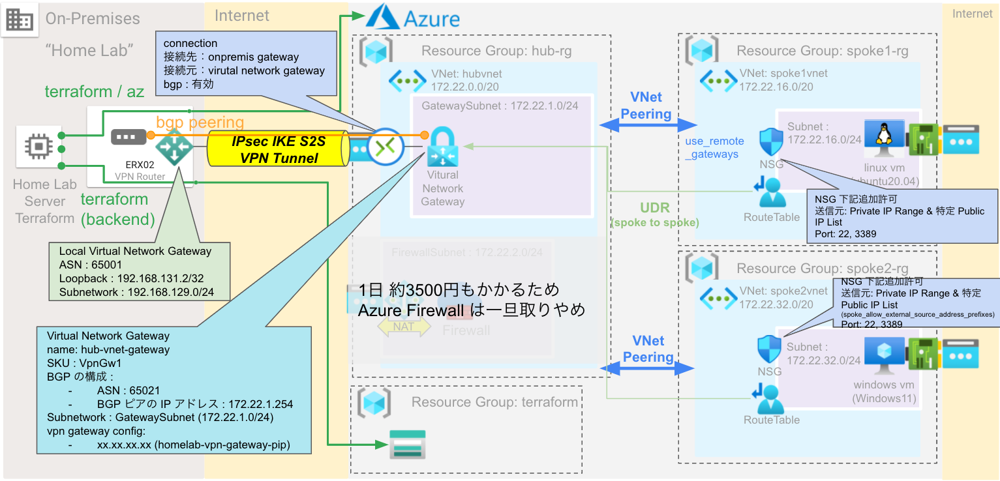
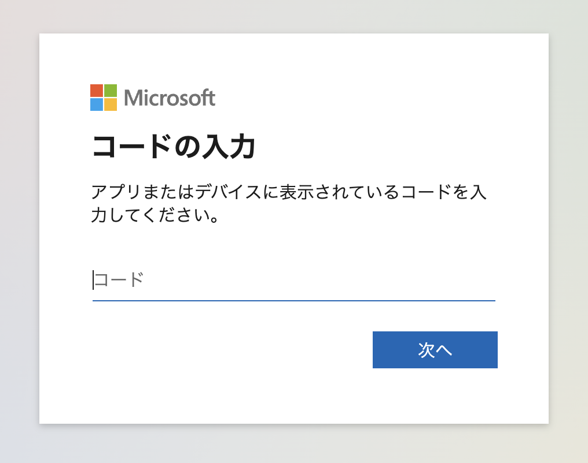
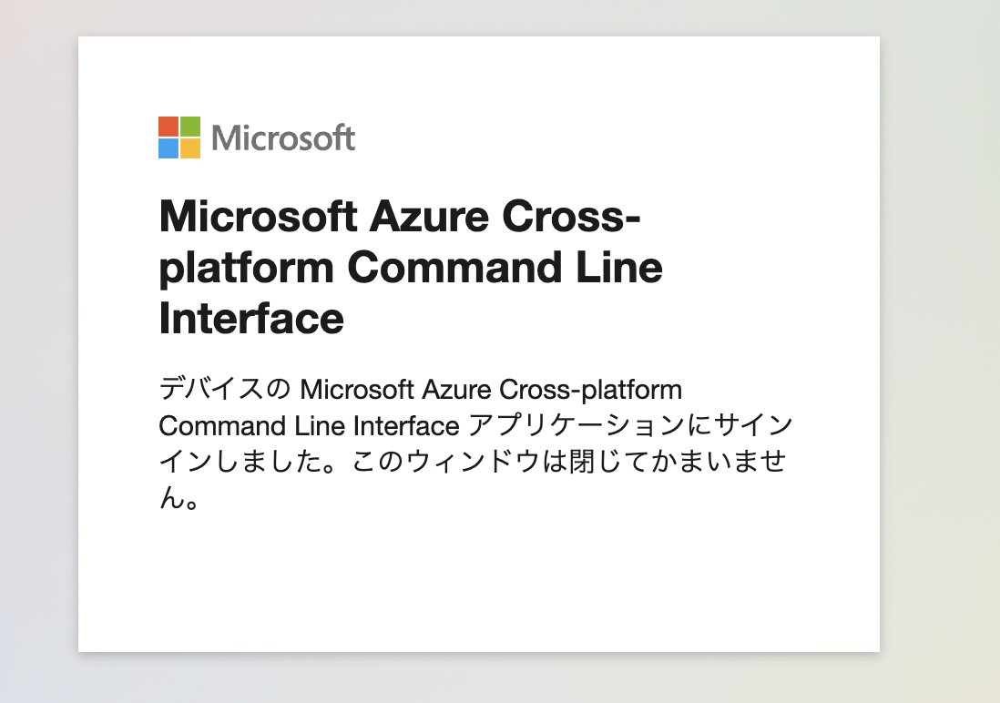

Azure Terraform
====

個人的に自宅ラボとして進めている Azure の Terraform Code

## 全体概要図



## azure-cli (az) Install

azure-cli (az) をインストールする
下記は、CentOS 向けのインストールコマンド例 (CLI, Ansible 両パターン。実環境では Ansible (CentOS8) で実施)


#### CLI

```
sudo rpm --import https://packages.microsoft.com/keys/microsoft.asc
```

```
echo -e "[azure-cli]
name=Azure CLI
baseurl=https://packages.microsoft.com/yumrepos/azure-cli
enabled=1
gpgcheck=1
gpgkey=https://packages.microsoft.com/keys/microsoft.asc" | sudo tee /etc/yum.repos.d/azure-cli.repo
```

```
sudo dnf install azure-cli
```

#### Ansible

```yaml:roles/az/tasks/main.yml
# https://docs.microsoft.com/ja-jp/cli/azure/install-azure-cli-linux?pivots=dnf#install

---
- name: az / install rpm key
  rpm_key:
    state: present
    key: https://packages.microsoft.com/keys/microsoft.asc
  become: true
  when:
    - ansible_distribution == "CentOS"

- name: az / install yum repository
  yum_repository:
    name: azure-cli
    description: "Azure CLI"
    baseurl: https://packages.microsoft.com/yumrepos/azure-cli
    enabled: no
    gpgcheck: yes
    repo_gpgcheck: yes
    gpgkey:
      - https://packages.microsoft.com/keys/microsoft.asc
  become: true
  when:
    - ansible_distribution == "CentOS"

- name: az / install azure-cli centos7
  yum:
    name: azure-cli
    state: latest
    enablerepo: "azure-cli"
  become: true
  when:
    - ansible_distribution == "CentOS"
    - ansible_distribution_major_version == "7"


- name: az / install azure-cli centos8
  dnf:
    name: azure-cli
    state: latest
    enablerepo: "azure-cli"
  become: true
  when:
    - ansible_distribution == "CentOS"
    - ansible_distribution_major_version == "8"
```

## az login
az コマンドを使用するために、初回ログインを実施する

```
% az login --use-device-code
To sign in, use a web browser to open the page https://microsoft.com/devicelogin and enter the code XXXXXXXXX to authenticate.
```

https://microsoft.com/devicelogin



`az login --use-device-code`で出力された code (例:`XXXXXXXXX`)を入力する



上記で認証が終わったので、サーバに戻って Enter を入力すると認証が完了する


## Create Backend

Terraform のバックエンドとして State ファイル置き場にするストレージアカウント・Blob コンテナを作成する

```sh
#!/bin/bash

RESOURCE_GROUP_NAME=tfstate
STORAGE_ACCOUNT_NAME=tfstate$RANDOM
CONTAINER_NAME=tfstate
AZURE_LOCATION=japaneast

# Create resource group
az group create --name $RESOURCE_GROUP_NAME --location $AZURE_LOCATION

# Create storage account
az storage account create --resource-group $RESOURCE_GROUP_NAME --name $STORAGE_ACCOUNT_NAME --sku Standard_LRS --encryption-services blob -l $AZURE_LOCATION

# Create blob container
az storage container create --name $CONTAINER_NAME --account-name $STORAGE_ACCOUNT_NAME
```

## Create ARM ACCESS KEY

```sh
#!/bin/bash

ACCOUNT_KEY=$(az storage account keys list --resource-group $RESOURCE_GROUP_NAME --account-name $STORAGE_ACCOUNT_NAME --query '[0].value' -o tsv)
export ARM_ACCESS_KEY=$ACCOUNT_KEY
```

## Export ARM Env

サービスプリンシパルを作成して環境変数を作成する

```sh
az ad sp create-for-rbac --name terraform --role Contributor
```

下記出力例

```sh:出力例
% az ad sp create-for-rbac --name terraform --role Contributor

Creating 'Contributor' role assignment under scope '/subscriptions/12345678-abcd-efgh-ijkl-123456789abc’
The output includes credentials that you must protect. Be sure that you do not include these credentials in your code or check the credentials into your source control. For more information, see https://aka.ms/azadsp-cli
'name' property in the output is deprecated and will be removed in the future. Use 'appId' instead.
{
  "appId": "87654321-4321-abcd-efgh-123456789abc",
  "displayName": "terraform",
  "name": "87654321-4321-abcd-efgh-123456789abc",
  "password": “XXXXXXXXXXXXXXXXXXXXXXXXXXXXXXXXXXX”,
  "tenant": “abcdefgh-abcd-4321-efgh-123456789abc"
}
```

上記出力から、環境変数を設定する

```sh
export ARM_SUBSCRIPTION_ID=12345678-abcd-efgh-ijkl-123456789abc
export ARM_CLIENT_ID=87654321-4321-abcd-efgh-123456789abc
export ARM_CLIENT_SECRET=XXXXXXXXXXXXXXXXXXXXXXXXXXXXXXXXXXX
export ARM_TENANT_ID=abcdefgh-abcd-4321-efgh-123456789abc
```

## main.tf 書き換え

main.tf の `storage_account_name` を実際に作成した値(`echo $STORAGE_ACCOUNT_NAME`)に書き換える

```tf:XXXXXの箇所を書き換える
    backend "azurerm" {
        storage_account_name = "XXXXX"
    }
```

## 変数作成

```
cd ~/azure-terraform/env/homelab/hub/
vi main.tf
cp -n terraform.tfvars.sample terraform.tfvars
vi terraform.tfvars
```

`XXXXX`になっている変数を穴埋め、その他パラメータを環境に合わせて修正

上記を各リソースフォルダでも同様に実施

```
cd ~/azure-terraform/env/homelab/spoke1/
cd ~/azure-terraform/env/homelab/spoke2/
```

## 実施

Hub リソース作成

```sh
cd ~/azure-terraform/env/homelab/hub/
terraform init
terraform plan
terraform apply
```

Spoke1 リソースグループ作成

```sh
cd ~/azure-terraform/env/homelab/spoke1/
terraform init
terraform plan -target=module.spoke-rg
terraform apply -target=module.spoke-rg
```

Spoke2 リソースグループ作成

```sh
cd ~/azure-terraform/env/homelab/spoke2/
terraform init
terraform plan -target=module.spoke-rg
terraform apply -target=module.spoke-rg
```

Hub to Spoke VNET ピアリング

Hub/Spoke1/Spoke2 での output 結果を参考に変数の穴埋めしてから実施

```sh
cd ~/azure-terraform/env/homelab/vnet-peering/
vi main.tf
cp -n terraform.tfvars.sample terraform.tfvars
vi terraform.tfvars
```

```sh
terraform init
terraform plan
terraform apply
```

Spoke1 リソース作成

```sh
cd ~/azure-terraform/env/homelab/spoke1/
terraform plan
terraform apply
```

Spoke2 リソース作成

```sh
cd ~/azure-terraform/env/homelab/spoke2/
terraform plan
terraform apply
```
