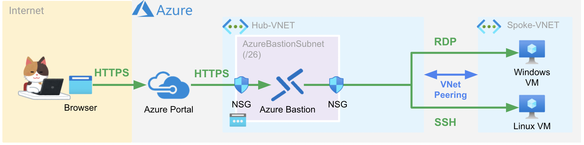

## Azure Bastion 概要
[Azure Bastion ドキュメント](https://docs.microsoft.com/ja-jp/azure/bastion/bastion-overview)から抜粋

- Azure portal を使用して仮想マシンに接続できるようにするサービス
    - ユーザの仮想ネットワーク内でプロビジョニングする、フル プラットフォーム マネージド PaaS サービス
- Azure portal から直接、TLS 経由で仮想マシンに RDP/SSH 接続
    - 接続先の仮想マシンにパブリック IP アドレス、エージェント、クライアント ソフトウェアはいずれも不要

利点は[ドキュメント](https://docs.microsoft.com/ja-jp/azure/bastion/bastion-overview#key)に表でまとまっているのでそちらを参照

### サブネット
Azure Bastion は指定された名前で指定されたサイズ以上で Subnet を作成する必要がある ([ドキュメント](https://docs.microsoft.com/ja-jp/azure/bastion/configuration-settings#subnet))

- サブネット名: **AzureBastionSubnet**
- サイズ    : **/26** 以上

### NSG (Network Security Group)

AzureBastionSubnet への NSG 設定は、指定されたルールを設定しないと設定ができない
必要なルールは[ドキュメント](https://docs.microsoft.com/ja-jp/azure/bastion/bastion-nsg#apply)から抜粋したものが下記の通り

Ingress Traffic

| 内容 | Port | Protocol | Source | Destination |
|:-:|:-:|:-:|:-:|:-:|
| パブリック インターネットからの Ingress トラフィック | 443 | Tcp | Internet  or 指定したパブリック IP アドレスのセット | Any |
| Azure Bastion からの Ingress トラフィックのコントロール プレーン | 443 | Tcp | GatewayManager | Any |
| Azure Load Balancer からの Ingress トラフィック | 443 | Tcp | AzureLoadBalancer | Any |
| Azure Bastion データ プレーンからの Ingress トラフィック | 8080, 5701 | Any | VirtualNetwork | VirtualNetwork |

Egress Traffic

| 内容 | Port | Protocol | Source | Destination |
|:-:|:-:|:-:|:-:|:-:|
| ターゲット VM への Egress トラフィック | 22, 3389 | Any | Any |  VirtualNetwork |
| Azure の他のパブリックエンド ポイントへの Egress トラフィック | 443 | Tcp | Any | AzureCloud |
| Azure Bastion データ プレーンへの Egress トラフィック | 8080, 5701 | Any | VirtualNetwork | VirtualNetwork |
| インターネットへの Egress トラフィック | 80 | Any | Any | Internet |

### SKU / コスト
SKU は `Basic` と `Standard` がある ([ドキュメント](https://docs.microsoft.com/ja-jp/azure/bastion/configuration-settings#skus))
価格を [Azure サイト](https://azure.microsoft.com/ja-jp/pricing/details/azure-bastion/)から抜粋したもの (2022.04.09 時点 / 1 USD = 122.71 JPY)

| SKU | 料金/時間 | 料金/月(31日) | 機能 |
|:--|:--|:--|:--|
| Basic | ¥23.315 | ¥17,346.36 | ・ピアリングされた仮想ネットワーク内のターゲット VM に接続する ・Azure Key Vault (AKV) で Linux VM のプライベート キーにアクセスする ・SSH を使用した Linux VM への接続 ・RDP を使用した Windows VM への接続 |
| Standard | ¥35.586 | ¥26,475.984 | Basic の機能に加えて下記の機能が追加される ・ホストのスケーリング (料金は2インスタンス含. それ以上の追加は ¥17.180 / 時間) ・カスタム受信ポートの指定 ・RDP を使用した Linux VM への接続 ・SSH を使用した Windows VM への接続 ・ファイルのアップロードまたはダウンロード |

追加で送信データ転送コストがかかる ([ドキュメント](https://azure.microsoft.com/ja-jp/pricing/details/azure-bastion/)参照. 最初の 5 GB/月は無料)

### 対応ブラウザ
2022.04.09 時点の [FAQ ページ](https://docs.microsoft.com/ja-jp/azure/bastion/bastion-faq#browsers)より抜粋

- HTML 5 をサポートしている必要がある
- Windows : Microsoft Edge または Google Chrome
- Mac : Google Chrome

### IPv6 非サポート
2022.04.09 時点、サポートされていない ([FAQ](https://docs.microsoft.com/ja-jp/azure/bastion/bastion-faq#is-ipv6-supported)から抜粋)

### 全体イメージ概要図

