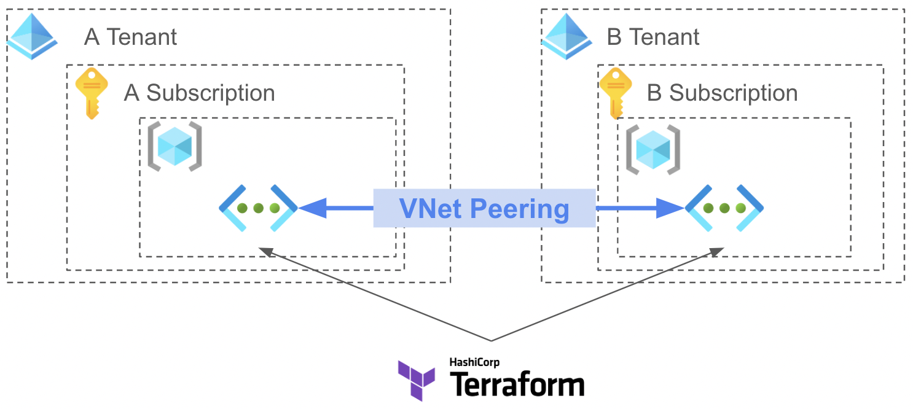
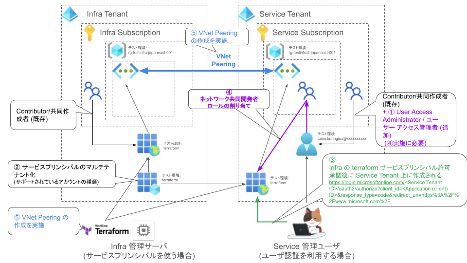

## 内容
マルチテナントでの Subscription 間 VNET Peering を Terraform で実施する



この module を使用する前に、必要に応じて 1. ~ 4. を実施する

1. User Access Administrator 権限設定
1. Terraform で使用するサービスプリンシパルのマルチテナント化
1. spoke での Terraform サービスプリンシパルのアクセス許可
1. spoke でのサービスプリンシパルへの IAM での権限追加
1. Terraform でのマルチテナント操作での VNet Peering

下記は全体の概要図と実施例での名称例




### 1. User Access Administrator 権限設定

ロールの割り当ての追加をするには、`Microsoft.Authorization/roleAssignments/write`が必要で、
組み込みロールで言うと `Owner` もしくは `User Access Administrator` (`ユーザー アクセス管理者`) のロールを持っている必要がある
([Azure ドキュメントの Terraform サービス プリンシパルの作成](https://docs.microsoft.com/ja-jp/azure/developer/terraform/authenticate-to-azure?tabs=bash#create-a-service-principal)で例に記載されている`Contributor`/`共同作成者`では無理なので注意)

`User Access Administrator` (`ユーザー アクセス管理者`) のロールを割り当てる

サブスクリプションやリソースグループの`アクセス制御(IAM)`で設定する


`ユーザー アクセス管理者`をクリックして`次へ`


`+メンバーを選択する`で選択するユーザをクリックして、`選択`してクリック
(ここではユーザにしているが、サービスプリンシパルで実施している場合は、サービスプリンシパルを選択)


`レビューと割り当て`を実施して割り当てる


### 2. Terraform サービスプリンシパルのマルチテナント化

`サポートされているアカウントの種類:` が`所属する組織のみ`になっている場合は、マルチテナント対応をする必要がある
`所属する組織のみ`をクリックする


下記を選択して、変更する
`任意の組織ディレクトリ内のアカウント (任意の Azure AD ディレクトリ - マルチテナント)`


`サポートされているアカウントの種類:` が `複数の組織`となっていることを確認


`API のアクセス許可` で `Microsoft Graph` の `User.Read` 権限を追加 (最初からマルチテナントでサービスプリンシパル作成しているとデフォルトで設定済)


### 3. spoke への Hub Terraform サービスプリンシパルのアクセス許可

マルチテナント化した Hub 側のサービスプリンシパルのアプリケーション ID (Application(client) ID) を参照する


spoke の`ディレクトリ(テナント)ID`(`Service Tenant ID`) を取得する


 

```
https://login.microsoftonline.com/<Service Tenant ID>/oauth2/authorize?client_id=<Application (client) ID>&response_type=code&redirect_uri=https%3A%2F%2Fwww.microsoft.com%2F
```

ブラウザでアクセスして`承認`する


`サインイン`で`エラー`となるが気にせずこのタブは閉じて良い


spoke 側の `エンタープライズ アプリケーション`に追加した`アプリケーション ID` でサービスプリンシパルが追加されていることが確認できる


### 4. spoke でのサービスプリンシパルへの IAM での権限追加

ひとつ前で追加した、Hubのアプリケーションのサービスプリンシパルへ spoke の VNET の`ネットワーク共同作成者`権限を付与する

#### GUI (Azure Portal) で実施する場合

spoke の VNET から`アクセス制御 (IAM)`へ移動して`ロールの割り当ての追加`を実施する


`ネットワーク共同作成者`を選択する


`+メンバーを選択する`をクリックして、追加したサービスプリンシパルをクリックして、`選択`をクリックして、
最後に`次へ`をクリック


`レビューと割り当て`をクリックして割り当てる


#### CLI (az-cli) で実施する場合

Spoke VNET の`プロパティ`で`リソース ID` を取得する


下記コマンドを`ユーザー アクセス管理者`ロールを持つユーザでログインした状態で実施

```sh
az role assignment create --role "Network Contributor" --assignee-object-id <サービスプリンシパルのオブジェクトID> --scope <Spoke VNET リソース ID> --assignee-principal-type ServicePrincipal
```

下記実行出力例


### 5. Terraform での VNet Peering 作成

Terraform で VNet Peering を作成する

1. ~ 4. 実施後に本 module を利用して作成する

サービスプリンシパルの ID/Password は環境変数に設定してから実施する


```sh
export ARM_CLIENT_ID=81XXXXXX-XXXX-XXXX-XXXX-XXXXXXXXXXX9
export ARM_CLIENT_SECRET=XXXXXXXXXXXXXXXXXXXXXXXXXXXXXXXXXXX
```

コードで指定も可能だが (./mai.tf にコメントアウト)、パスワード情報のコードかは非推奨
